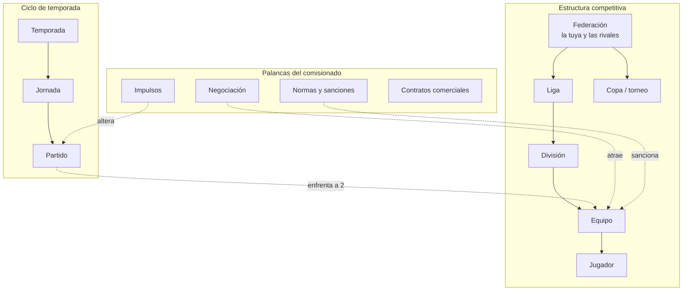
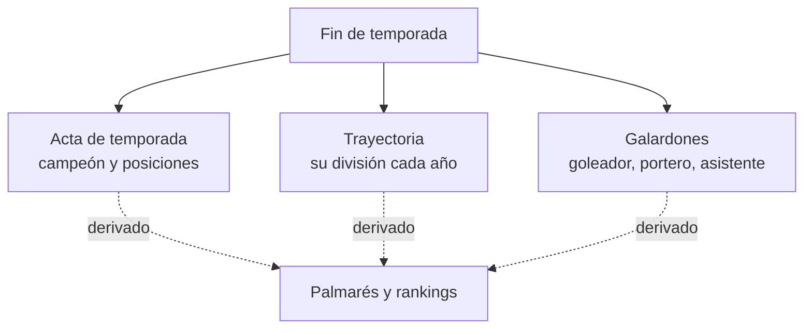

# Simulador de gestión de liga de fútbol
## Documento de diseño

*Estado: diseño cerrado, listo para construir. Versión 1 — mayo 2026.*

Un juego de gestión inspirado en *Total Extreme Wrestling*, pero de fútbol. El jugador no dirige un club ni a un jugador: dirige **una competición**. Empieza con una liga modesta de 10 equipos y, temporada a temporada, la convierte en una liga universal capaz de atraer a los mejores clubes del mundo. La interfaz es de solo datos —tablas y listas, sin motor 3D— y la simulación es rápida.

---

## 1. El bucle central

En una frase:

> Simulas jornadas rápido → revisas resultados y los pocos conflictos que surjan → aplicas sanciones o gastas un impulso si quieres → al cerrar la temporada gestionas lo comercial y la estructura → la liga gana o pierde prestigio → el prestigio determina a qué equipos puedes aspirar.

El ciclo de una temporada:

1. **Pretemporada** — sorteo de jornadas (automático), firma de patrocinios y derechos, definición de premios y reparto.
2. **Temporada** — el jugador simula jornadas. Ve resultados, goleadores, tarjetas. Resuelve conflictos puntuales y aplica sanciones o impulsos.
3. **Cierre** — se calcula la clasificación final, ascensos y descensos. Se escribe el registro histórico.
4. **Revisión estructural** — el jugador decide si expande, abre una nueva división o lanza un torneo. Avanzan las negociaciones de adhesión.

---

## 2. Principios de diseño

Decisiones no negociables. Si una funcionalidad las contradice, la funcionalidad está mal.

- **Comisionado, no entrenador.** Los equipos son autónomos: fichan, eligen entrenador, estilo de juego, cantera, etc. por su cuenta. El jugador solo los consulta y valida que cumplan las normas. En cuanto el jugador pueda fichar por un equipo, el juego deja de ser lo que es y se convierte en otro Football Manager.
- **Simulación rápida, pocas interrupciones.** Los conflictos y polémicas existen, pero son escasos. El placer central es avanzar jornadas con fluidez.
- **Solo datos.** Tablas, listas, números. Sin motor de partido visual. Esto abarata el desarrollo y es coherente con el género.

---

## 3. Modelo de entidades

### Entidades y atributos clave

| Entidad | Atributos clave | Notas |
|---|---|---|
| **Federación** | prestigio, tier (1–5), es_jugador | La tuya y las rivales son el *mismo* tipo, distinguidas por un flag. Da simetría y permite que las rivales actúen igual que tú. |
| **Liga** | nombre, formato | Una federación organiza una liga (con varias divisiones). |
| **División** | orden (1 = máxima), plazas | Un escalón de la liga. |
| **Equipo** | prestigio, arraigo, presupuesto, afición, estadio | Pertenece a una federación y ocupa una división. Absorbe a sus hijos: plantilla, cuerpo técnico, cantera, equipo médico, ojeadores. |
| **Jugador** | posición, calidad | Pertenece a un equipo. |
| **Copa / torneo** | tipo, formato | Tipos: copa, liga juvenil, torneo de verano, liga de nivelación. |
| **Temporada** | año, impulsos_restantes | Contenedor de tiempo. |
| **Jornada** | número | La unidad que el jugador simula. |
| **Partido** | equipo_local, equipo_visitante, goles, tarjetas | Enfrenta a dos equipos de la estructura. |
| **Negociación** | equipo_objetivo, estado, requisitos[], año_inicio, año_efectivo | Entidad con ciclo de vida propio (ver §4.2). |
| **Norma** | tipo, valor | Reglas que define el jugador (ej. tope salarial). |
| **Sanción** | equipo, motivo, castigo | Se aplica a un equipo que incumple una norma. |
| **Impulso** | temporada, partido, equipo_beneficiado, efecto | Cuelga de Temporada (contador anual); apunta a un partido concreto. |
| **Contrato comercial** | tipo, valor_anual | Patrocinio, publicidad, derechos de TV, derechos de imagen. |

### Decisiones de modelado

- **Federación es una sola entidad.** No duplicar lógica entre "mi liga" y "las rivales".
- **Nada se borra de verdad.** Un equipo que abandona la liga sigue existiendo: solo cambia de federación (o a ninguna). Borrarlo rompería su historial. Todo es cambio de estado o de asociación, nunca eliminación.
- **La revisión estructural anual no es una entidad**, es un momento del ciclo de temporada.

---

## 4. Sistemas de juego

### 4.1 Prestigio y tiers

El prestigio es el marcador del juego. Tu federación tiene un número de prestigio; las rivales también. Robar un equipo mueve prestigio de una federación a otra.

El prestigio se agrupa en al menos **5 tiers**. El tier es prelatorio: una federación de tier 4 no puede ni acercarse a negociar con equipos de un tier superior. Esto evita que en el primer año tengas a un club de élite y obliga a un crecimiento progresivo.

### 4.2 Negociación y adhesión de equipos

Atraer un equipo es un proceso largo, no inmediato:

1. **Requisito de tier** — solo se puede iniciar si el tier lo permite.
2. **Recolección de requisitos** — el equipo pide condiciones: audiencia mínima, porcentaje de reparto, prestigio, etc. Esta fase puede durar un par de años.
3. **Oferta y aceptación** — el jugador cumple los requisitos y el equipo acepta.
4. **Adhesión efectiva** — el cambio se refleja **dos años después** de la aceptación.

El proceso completo puede durar hasta 5 años. La remoción de un equipo sigue la misma demora de dos años.

La primera temporada siempre arranca con 10 equipos elegidos por el jugador (clubes reales, posiblemente de divisiones inferiores). A partir de ahí, toda alta o baja sigue la dinámica de los dos años.

### 4.3 Crear equipos propios

Alternativa al robo: la federación del jugador puede crear equipos desde cero. Empiezan compitiendo en la división más baja. Es un camino lento pero que no depende del tier ni de la negociación. Da dos estrategias de crecimiento: comprar o construir.

### 4.4 Estructura: divisiones, ligas de nivelación, torneos

El jugador define su liga como quiera, pero de forma progresiva: con 10 equipos no tiene sentido tener 4 divisiones. Antes de abrir una división nueva debe celebrarse una **liga de nivelación** que decida qué equipos quedan en cada división. El jugador también puede crear torneos: copas, ligas juveniles, torneos de verano.

### 4.5 Economía

El jugador firma patrocinios, publicidad, derechos televisivos y de imagen; define los premios y su reparto entre los equipos; e invierte en la formación de talentos. Los ingresos comerciales deben escalar con el tamaño de la liga (ver §5).

### 4.6 Impulsos

Inspirado en los juegos de booking de lucha libre. El jugador dispone de un número limitado de impulsos por temporada (p. ej. 5). Un impulso beneficia a un equipo en un partido concreto. Es el "dedo en la balanza" del comisionado.

### 4.7 Normas y sanciones

El jugador define normas (tope salarial, etc.). Los equipos, autónomos, pueden incumplirlas. El jugador sanciona a quien las incumpla.

### 4.8 Revisión estructural anual

Cada nueva temporada se abre la ventana para decidir expansiones, nuevas divisiones o nuevos torneos.

---

## 5. El problema del bola de nieve

Si robar un equipo sube tu prestigio y baja el de la federación rival, el juego puede degenerar: robas → subes → robas mejores → en pocas temporadas tienes todos los equipos buenos y las rivales son cáscaras vacías. Frenos previstos:

- **Demora de dos años** — ya integrada. Cada adhesión es una apuesta a futuro; equivocarse cuesta.
- **Salto de tier** — frena la fase inicial: con prestigio bajo solo alcanzas equipos modestos.
- **Arraigo a la federación** — además del prestigio, cada equipo tiene un vínculo con su federación. Robar un equipo muy arraigado cuesta mucho aunque tu prestigio sobre. Este freno sigue funcionando en la fase tardía.
- **Tensión financiera** — si los ingresos comerciales no escalan al ritmo de los equipos que añades, expandirte arruina.
- **Federaciones reactivas** — las rivales no son presa pasiva: una federación debilitada baja barreras para retener equipos, e incluso roba (a otras rivales y al jugador).

---

## 6. Capa de historial

El historial **no es parte del modelo de estado actual**. Es un registro aparte que se escribe una vez, al cerrar la temporada, y nunca se vuelve a tocar (append-only).

- **Acta de temporada** — por competición y temporada: campeón, clasificación final, ascensos y descensos.
- **Trayectoria** — una fila por equipo y temporada: división y puesto final. Es lo que permite leer "este equipo viene escalando temporada a temporada".
- **Galardones** — solo categorías clave por temporada: máximo goleador, máximo asistente, mejor portero. No la ficha completa de cada jugador; así el historial se mantiene ligero.

**El palmarés no se guarda.** Es una vista derivada de las actas (los títulos de un equipo = todas las actas donde figura como campeón). Una sola fuente de verdad; todo lo demás se consulta. Lo mismo para los rankings históricos de goleadores, derivados de los galardones.

---

## 7. Cuestiones abiertas

Pendientes de decidir, no bloquean el prototipo:

- **Estado de derrota.** ¿Hay un fin de partida (quiebra, pérdida de prestigio) o es sandbox abierto como TEW?
- **Mecánica fina de recolección de requisitos.** Cómo se descubren y se cumplen exactamente los requisitos de cada equipo.
- **Fidelidad del motor de partidos.** Empieza como aleatorio ponderado; el realismo se añade como última capa, no la primera.

---

## 8. Hoja de ruta de construcción

Orden de trabajo (los pasos 1–2 son diseño, ya hechos):

1. **Esquema de datos** — traducir el modelo de entidades a tablas.
2. **Bucle mínimo** — simular una temporada y producir una clasificación coherente. El partido es aleatorio ponderado por la calidad media de las plantillas. Nada más.
3. **Sistemas del comisionado** — prestigio, tiers, negociación, frenos al bola de nieve, federaciones reactivas.
4. **Historial** — las tablas append-only y las vistas derivadas.
5. **Pulido** — realismo del motor de partidos, eventos, polémicas.

### Stack y vías

**Prototipo (validar diversión):** un único Artifact en React, en memoria, sin backend. Liga de 10 equipos, tabla, botón de avanzar temporada, prestigio. Responde la pregunta clave —¿engancha?— antes de invertir semanas.

**Proyecto real:** NestJS + TypeScript de backend; PostgreSQL (el modelo es 100% relacional y las tablas de historial son append-only); React de frontend (tablas de datos). Este documento se deja en el repo como contexto.

**Fase 3 — análisis e IA:** con los datos históricos estructurados, un servicio en Python puede detectar patrones narrativos ("este equipo lleva tres años escalando") y un LLM puede generar crónicas y titulares de cada temporada. No incluir nada de esto en el prototipo.
